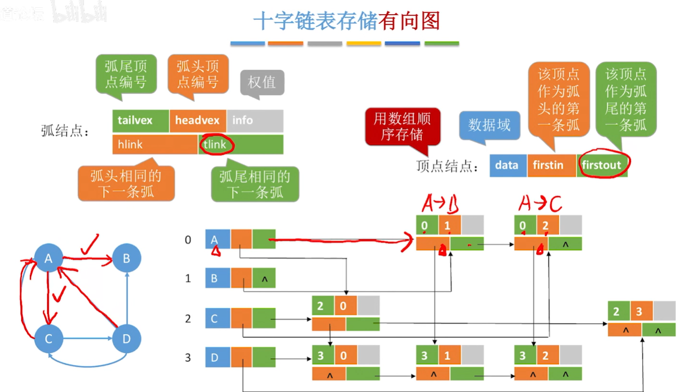

数据类型是什么:用来刻画操作对象的特性,数据结构是一个值的集合和其可使用的操作组的总称.

什么是抽象数据类型:一个数学模型以及定义在该模型上的一系列操作.抽象数据类型仅取决于它的逻辑结构,与他的具体实现无关

抽象数据类型可以分为哪几类:原子类型(int,float),固定聚合类型(班级姓名学号),可变聚合类型(字符).

直接访问数据方式和间接访问数据方式:直接访问中变量包含地址和内容,使用变量名可以直接访问内存上的内容,而间接中只有先从其他内存中获得变量地址,再访问.

算法的五个特性:有穷性,确定性,可行性,

什么是冒泡排序:从数组的头部开始,不断比较元素的大小,让较大的元素逐渐的移动到后面

复杂度和算法复杂度分别是:复杂度可以用描写这一事物所用的计算机语言的长度来衡量. 算法复杂度可以用算法编写成可执行程序后,运行所需要的资源,有时间复杂度(执行步骤数量)和空间复杂度(所需内存大小),

线性表和链表: 线性表适合查找频繁的场景(是一段连续的储存空间),链表适合插入删除频繁的场景(是分散存储).

随机存储的三种主要存储方式:链式存储,索引存储,散列存储.

栈,队列,堆的区别:栈只能先进后出,队列可以先进先出,堆没有要求.

矩阵压缩存储:只存储非零元素,以及其对应的行列信息.
    
广义表:n个表元素组成的有限序列.可递归:广义表的子列可以是自身.

递归设计的实质就是当一个复杂的问题可以分解成若干子问题来处理的时候,其中的子问题和原问题有相同的特征驱性,可利用与原问题相同的分析处理方法(利用了问题的自相似性和归纳思想,使得问题可以通过简单,重复的步骤解决);

在对广义表进行的操作下的规定意识的两种分析方法是什么:1.(分为表头和表尾)2.(看成是n个并列的子列)

树包含一个根节点,每个节点可以拥有0或多个子节点,任意两个节点间存在仅存的为一个路径. 子树是树的一部分

有序树,无序树,森林:有序树是各子树从左至右有顺序的,否则成为无序树,森林是m课互不相交的树的集合.

先中后序遍历二叉树的定义.

由树结构的定义说出两种次序遍历树的方法.

十字链表在弧节点的五个域是什么
   

十字链表头节点的三个域是什么

图的遍历及其算法的描述是什么

根据系统运行的不同情况,可以利用空间表的3种不同结构是什么?

收集无用单元应分的两步是什么?   1.标记所有已占用结点加上标志, 2.对可利用存储空间顺序扫描一边,标记域为0的节点连接成新的可利用空间表.

顺序查找算法的优缺点?

什么是二叉排序树(BST)?

常用构建哈希函数的方式有: 除留余数法(取除p后的留数,p为最接近表长的最大质数)-直接定址法(线性构造)-数字分析法(取数码分布较均匀的若干位作为散列地址)-平方取中法(关键字每一位都不均匀,平方后中间的取值会受到每一位的影响)

_Mar22_

什么是快速排序? 

在快速排序-堆排序(大根堆:根>左,右-实现方法为将分结点与孩子中更大的那个互换,~小元素下坠)-归并排序中,什么排序是最稳定的?: 归并排序是最稳定的.

冒泡排序两个for循环分别有什么作用?

计算机的两种存储:内存储器和外存储器.内存为随机存储,外存储中:磁带是顺序存储,磁盘是随机存储.

