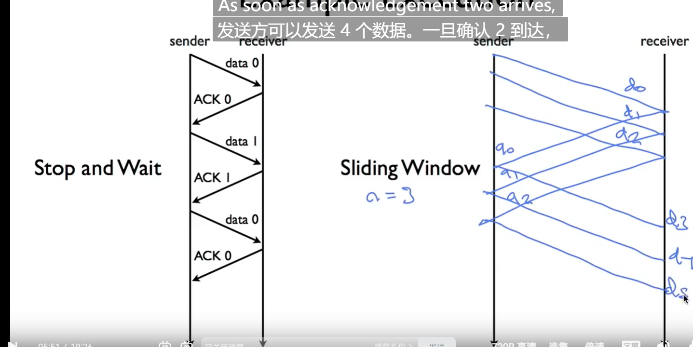
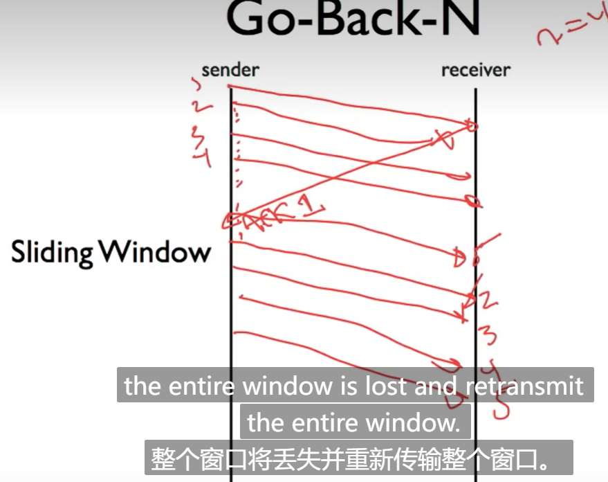
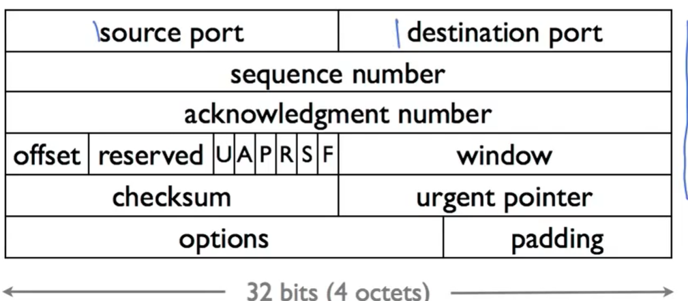

# cs144 Computer networking 1-2 

| Application | application |
| :---------: | :----------: |
|             |  presentation |
 
Ip service Model : 

| Property | Behaviour |
| :------: | :-------: |
| Datagram | 

1. ip wil fragemaent if is to long
2. Uses a header checksum to reduce chances of delivering data gram to wrong destination.
3. ipv4 protocol :6 meaning has tcp  
 
 # 1-4 A Day in the life of a packet
 ## Tcp Bytes Stream
  " 3 - way handshake "
  " syn,syn/ack,ack"

# Lecture 06  

_24 Dec26_z   

layers can only comunicate with next layers, 
different layers is a functional component ,like to the code program C++ => assembelly 

## lecture 7

* encapsulating  :  wifi fram(ethernet) =>ip => tcp => http
* different deaw order 
## Lecture 8-1a 

_dec27_

 Little endian: 0x00 0x04  (computatinal standpoint)
 Big endian:    0x04f 0x00  (Makes most sense to a human reader )

_Dec28 _
netmask 192.168.0.255
netmask of 255.128.0.0 means if the first 9 bits match :is in the same network,send directly ,dont need the router

_Dec29_

# Longest Prefix match
127.1.2.0/16 => 127.1.123.122

# Address Resolution Protocol
 
 # 2 Tcp trans
 
 A -Fin->  B 

 A <-(Data) -B
 sequence nuber
 Congestion control 
Tcp : reliable :IANA website :for port number
From: 9527@stanford.edu
X-You-Said-Your-SunetID-Was: 9527    
MAIL FROM: 9527@stanford.edu
RCPT TO: 9529@stanford.edu

RCPT TO:wanghy1909@gmail.com
RCPT TO: cs144grader@gmail.com
X-Your-Code-Is: 189952
Content-length: 108
Vary: Accept-Encoding

#  UDP
Connectionless Datagram Service
Self contained datagrams
Unreliable delivery

wrapper包裹 DNS DHTP 
# ICMP 
The internet control message protocol
a method for error report

unliable 
check more in inernet: RFC792 

# The End-to-End Principle

fringe 边缘

_Dce30_

git add . (save all)

# Error Detection ：3 Scheme

Checksum，CRC and MAC

CRC robust polynomial CRC padded 

# Finite State Machines

State1    _________________-> State2
这块先放一放，没睡好学不懂

# Flow control

_Dec31_
Sliding Window 

Sliding Windos 计算window size fill 性能
stop - wait  
# Retransmistting

GO Bcac N

Selective Repeat

# TCP header

20byte payload

## TCP set up and tear down
simultaneous
 metadata (headers) that specifies things like the source and destination addresses—what computer it
came from, and what computer it’s headed towards

linux : 
> sudo ：管理员命令
> cd .. :返回上一级
>ls  展示所有
`pwd` 展示当前级

{
hint 提示
}

_2025jun1_

# git skills

touch index.html  | create a file :index.html

git init 

git add .  :save all changes

git commit -m '<name>' :save the changes and name the change

git log 查看git提交记录and hash code

git checkout <hash code>

## github

repository == folder

