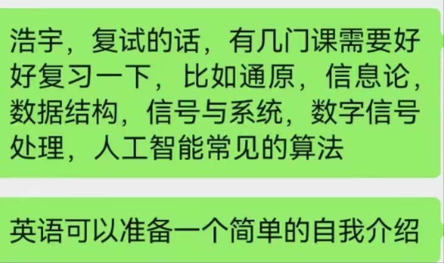

_MAR1_
自我介绍：对于听书读写的能力，撰写论文的能力，连贯流畅

实践环节：那些课设，那些实验.
学科竞赛：如果没有就说是参加了那些活动，
研究领域：排队、安全、分配。

导师会倾向于有明确的研究方向

转专业的原因：调动语言展现自我独特的优势。

_Mar2_

AI 与数据结构联系紧密，主要体现在以下方面：

数据存储管理：AI 处理的海量数据需合理存储和管理，数据结构可提供有效方式。例如集合数据结构，用于存储和管理自然语言处理中的词汇表、词性标注等信息；计算机视觉中的图像特征、物体检测信息 ；推荐系
统中的用户行为、商品特征等信息。算法实现基础：数据结构是 AI 算法实现的基础，不同算法需匹配对应数据结构以提升效率。如搜索算法常基于树、图等数据结构实现，哈希表作为集合数据结构的底层数据
结构，能实现快速添加、删除和判断操作，
这在 AI 数据处理和模型训练中十分关键。
优化 AI 性能：合适的数据结构可优化 AI 系统性能，减少资源消耗和运行时间。比如在处理大规模图像或文本数据时，选择高效数据结构组织数据，能加速模型训练和推理过程。
支持模型构建：在构建 AI 模型如神经网络时，数据结构用于组织神经元连接、权重和数据流动，像张量这种特殊数据结构，是深度学习框架中处理多维数据的基础

1.本科毕业论文设计和研究生阶段的研究方向，用专业的、简练的、精准的，概括性的文字整理出来，背的特别熟练。（也可以让你哥哥帮你修改一下）
2.英语的自我介绍，自己用英语书面写出来，发到群里，让你姑父或者哥哥帮你改一下，然后背的特别熟练，流利的说出来。

问题一：你本科学习应用物理专业，为什么研究生报考人工智能？
回答：1，首先我对人工智能就特别感兴趣，本科阶段学习应用物理，也是我学习和职业规划的一部分；只有本科阶段学习好物理和数学，具备数学、编程和问题解决能力，才能为学习人工智能提供坚实的基础。
2，物理学习训练培养的逻辑思维和问题解决能力，在AI领域同样适用；物理专业能为人工智能研究带来独特的视角，尤其是在涉及物理模型或复杂系统时。
3，应用物理与人工智能本身就有交叉点，如机器学习中的物理模型、量子计算等，对跨学科学习和拓宽研究领域，更有帮助。
4.所以跨专业报考人工智能，既有兴趣的原因，也有学科交叉和融合的驱动。跨专业恰恰为我研究生学习和发展带来独特的创新潜力。

研究设想一，用人工ECG模型诊断急性心梗，就是人工智能在医疗中的应用。现在步入老龄化社会，心血管病居高不下，尤其是急性心梗是国民健康的巨大威胁！我在毕业设计阶段用pytorch和python'识别手写数字，
做得很有收获，准备研究生期间，利用PyTorch library and Python基于残差神经网络构建AI_ECG模型，识别急性心梗，提高心梗诊断的快速准确识别，尤其心梗伴合并症如急
性心衰等的鉴别诊断。以前在nature等杂志已发表研究卷积神经网络，TensorFlow可以用来诊断心梗，现在随着pytorch和transformer的应用，尤其是deepseek的成功为我们提供了新的思路！

浩宇，复试的话，有几门课需要好好复习一下，比如通原，信息论，数据结构，信号与系统，数字信号处理，人工智能常见的算法
英语可以准备一个简单的自我介绍

别kaggle了，找篇简单点的论文，改改yolo这样就差不多了

请问复现两篇论文再包装一下具体是怎么搞哇？是比如一个模型然后给他弄到具体的数据集实现具体的下游任务吗？

联系导师的作用是便于录取之后选好老师提前了解占坑，对复试没有一点作用，而且你分低大概率也没有几个老师会搭理你，但是还是建议你多发，提前线下见见老师被拷打拷打当模拟复试了

对比项	BFGS / L-BFGS	SGD
收敛速度	更快，迭代次数少	需要更多迭代
学习率	自适应步长调整	需要手动调参
局部最优	更容易跳出局部最优	可能陷入局部最优
参数尺度适应性	更鲁棒，不依赖额外优化器	需要 Adam/ RMSProp 等优化器
内存占用	BFGS 高，L-BFGS 低	低
🚀 什么时候选择 BFGS / L-BFGS 而非 SGD？
✅ 适用 BFGS / L-BFGS 的情况：

小型或中型神经网络（如 10w 参数以内的网络）。

优化后期加速收敛（先用 SGD 预训练，再用 L-BFGS 调优）。

高维特征学习问题（如 NLP 词向量训练）。

✅ 仍适合 SGD 的情况：

深度神经网络（如 ResNet, Transformer），BFGS 计算 Hessian 太大，不适用。

在线学习（Streaming Data），BFGS 需要存储历史梯度，而 SGD 可逐步学习新数据。

为什么选择 L-BFGS 而不是 SGD？
计算开销更低：

L-BFGS 仅存储近几步梯度信息，不会像 BFGS 那样维护完整的 Hessian 矩阵，因此更节省内存，适用于 高维变换参数（如非刚性配准）。

对于 全局影像对齐（Rigid / Affine Registration），L-BFGS 的收敛速度比 SGD 快，避免了大步长震荡问题。

更适合连续优化问题：

影像对齐是一个 连续优化问题，不像神经网络那样需要大量随机梯度更新，因此 全批次梯度 的 L-BFGS 能稳定收敛，而 SGD 可能受随机梯度噪声影响。

收敛速度快：

L-BFGS 在低维优化问题上通常优于 SGD，因为它 利用过去梯度近似 Hessian 信息，能更快找到最优变换参数。

适用于非线性优化（如仿射、非刚性对齐），SGD 由于无二阶信息，通常需要更多迭代才能收敛。

用更合适的Lbfgs方法可以更稳定的优化多层神经网络,避免了SGD方法收到随机梯度噪声的影响,同时可以避免大步长震荡问题.

1.英语:2.简历的完善 .