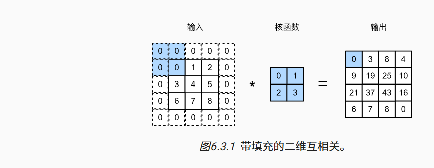
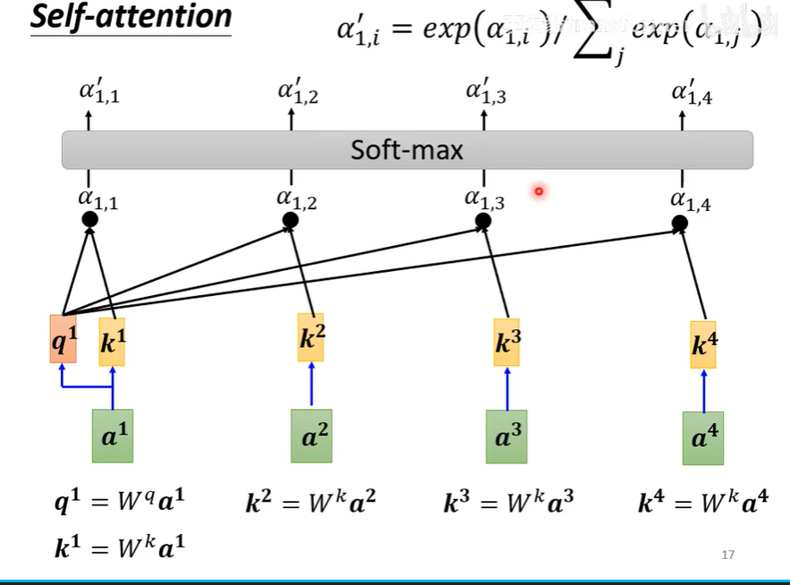
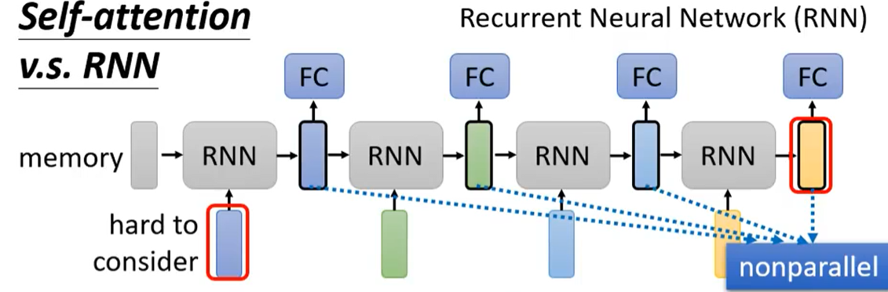

什么是正则化,是指防止模型欠拟合与过拟合的操作,通过惩罚限制模型的复杂度,提高模型的泛化能力

卷积神经网络:重点考虑:1.平移不变性2.局部性原则.

卷积核跟权重一样随机初始化

块（block）可以描述单个层、由多个层组成的组件或整个模型本身。 使用块进行抽象的一个好处是可以将一些块组合成更大的组件， 这一过程通常是递归的，如 图5.1.1所示。 通过定义代码来按需生成任意复杂度的块， 我们可以通过简洁的代码实现复杂的神经网络。
  

填充
防止丢失边缘像素
  

步幅
  

pooling汇聚

通过固定窗口对特征图进行降维，减小特征图的宽度和高度。 和下采样（Subsampling）
  

监督学习和无监督学习:无监督学习没有标签数据,常用于检测异常.

L1正则化和L2正则化的区别?:L1是求权重的绝对值之和,可以生成稀疏模型，利于特征选择。L2是求权重的各个元素的平方和再求平方根.防止模型过拟合.

交叉检验:数据集分成K份,K-1训练,1份检验,然后一轮后重新K-1份进行训练数据.

ROC曲线就是真阳性和假阳性在不同阈值下绘制的曲线,越靠近左上角模型性能越好.

什么是支持向量机?:监督学习机制,用于分类任务.核心思想是分割间隔最大化,构建一个分割面,若不可分,利用核函数映射到高维空间,特点是1.间隔最大化2.

KNN,K最邻近法算法:针对测试数据x,寻找k个最近的数据,并把x归类为k个数据中最多的那类.

K均值算法:计算数据到簇中心距离的均值,迭代求收敛,用于计算数据聚类的算法.(无监督学习聚类算法，旨在将数据集划分为K个簇，使得簇内的数据点相似度尽可能高，而簇间的数据点相似度尽可能低。​)

KNN和K-mean聚类有什么不同?

什么是反馈神经网络BP神经网络?:在训练神经网络时，在初始化模型参数后， 我们交替使用前向传播和反向传播，利用反向传播给出的梯度来更新模型参数

机器学习中距离和相似度的度量:欧式距离,曼哈顿距离:两点之间按坐标轴方向的距离和,切比雪夫距离:坐标轴方向距离的最大值,汉明距离:.

如何评价机器学习模型的有效性:Roc曲线,Auc值,精准率,召回率.评价回归结果:均方误差,均方根误差

激活函数有哪些,作用是什么?:Relu,s大igmiod,Tanh,是为了添加非线性.解决模型分析表达能力不足的问题.

梯度消失和梯度爆炸:链式法不断乘以于一或小于1的数导致梯度很小或很大.

一维卷积和二维卷积是什么:

交叉熵损失:预测的概率分布与真实标签的概率分布之间的差异
  

dropout:一种正则化方法,在训练的过程中随机丢弃神经元,减少对某个神经元的以来.

卷积神经网络的感受野:卷积神经网络输出的特征图像上的像素点在原始图像上映射的区域大小.
  

什么样的数据集适合深度学习?:1.样本数量不足2.数据集没有局部相关特性.

Transformer:self-attention

  
  

基于文本表征的方法有哪些? :词向量动态表征有GPT,BERT,固定表征Word2vec.

什么是Embeddeding?:将高维离散数据（如单词、图像、音频等）映射到低维连续向量空间的技术。​这种映射使得在语义或特征上相似的数据在向量空间中也彼此接近，从而便于计算机进行处理和分析

牛顿法:
  

RNN
  

初始化权重为什么不能为0?:全为0意味着输出相同,梯度也相同,参数无法更新.

批归一化:在训练过程中对每个小批量（mini-batch）的中间层输出进行标准化处理，从而使得各层的输出值更加稳定 ,避免"内部协变量偏移(网络中每一层的参数更新都会导致后续层接收到的输入数据的分布发生变化)",可以加速模型训练

什么是预训练模型?:使用大规模的数据进行训练,使得模型可以在目标任务上更快的学习.

什么是偏差和方差?:偏差学习算法本身的拟合能力.方差刻画训练集变化所导致的学习性能的变化,

<<生活在别处>>
  

Transformer  

add&norm:add就是一个残差连接,H(x)=F(x)+x,(最初是用来应对模型中随着网络层数的增加引发的退化问题而提出的selution.)

mask self-attention:Decoder中用来使输出时只能使用之前的信息的方法,
  

迁移学习的几种方式:1.特征提取(Feature Extractor)2.微调(Fine-tuning)
